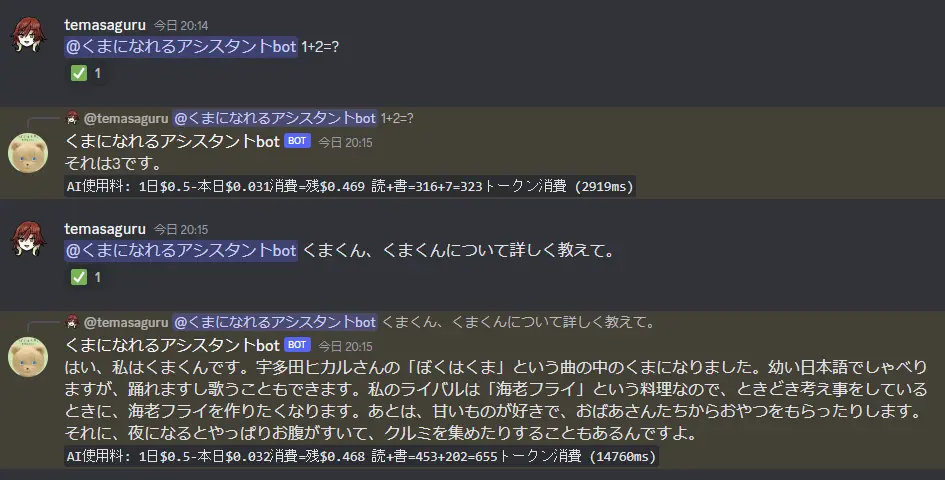

# multi-persona-chatgpt-discordbot

複数の人格を使い分けるChat GPT bot。

## 仕組み

- 「教育内容」「履歴」「あいさつ」「ユーザーの質問」を読むことで人格を形成する。
- **各人格の記憶は独立しているため、他人格の回答を引き継ぐことはできない。**
  - ChatGPTにとって回答者は `assistant` だけであり、混ぜると人格がぶれてしまうためこの仕様にしている。
- 記憶が増えると古い順に削除していく。
  - 「教育内容」「あいさつ」は変わらない。

### ChatGPTに読ませるメッセージ部分の例



上記の会話では、以下のようなメッセージをChatGPTに送信している。

#### 例: メイン人格の記憶

```ts
[
  { role: 'system', content: '今からBotくんというアシスタントになりきって日本語で答えてください。' },
  // ここに今までの会話
  { role: 'assistant', content: 'こんにちはBotくんです。なにか御用ですか?' },
  { role: 'user', content: 'ねえBotくん、 1+2=?' },
]
```

#### 例: サブ人格の記憶

```ts
[
  {
    role: 'system',
    content: 'あなたは今から宇多田ヒカルの「ぼくはくま」のくまになりきって日本語で答えてください。くまのプロフィールは以下のとおりです。\n' +
      '- 幼い言葉で喋ります\n' +
      '- 歩けないけど踊れる\n' +
      '- しゃべれないけど歌える\n' +
      '- ライバルは海老フライ'
  },
  // ここに今までの会話
  { role: 'assistant', content: 'こんにちは。ぼくはくま。くるまじゃないよ。' },
  { role: 'user', content: 'ねえくま、 くまくん、くまくんについて詳しく教えて。' }
]
```

## 事前準備

### Discord

`bot`スコープ、メッセージの送信、リアクションの権限が必要。

また、**管理画面で `MESSAGE CONTENT INTENT` を有効化する** こと。

### Railway

#### Redis

以下のキーを作る。

- `discord-bot:openai:total-token-string` (string)
  - JST0時にリセットされる
- `discord-bot:openai:assistant:trigger-words-hash` (hash)
  - `人格キー: ["トリガーワード", ...]` (必須)
- `discord-bot:openai:assistant:names-hash` (hash)
  - `default: デフォルト人格名` (必須)
  - `人格キー: 人格名` (各人格ごとに作る)
- `discord-bot:openai:assistant:system-messages-hash` (hash)
  - `default: デフォルト教育内容` (必須)
  - `人格キー: 教育内容` (各人格ごとに作る)
- `discord-bot:openai:assistant:last-messages-hash` (hash)
  - `default: こんにちは〇〇です。なにか御用ですか?` (必須)
  - `人格キー: なにか御用ですか？的なメッセージ` (各人格ごとに作る)
- `discord-bot:openai:message-history-for-assistants-hash` (hash)
  - 内容の設定は不要

設定例:

- `discord-bot:openai:assistant:trigger-words-hash`
  - `kuma: ["くまくん", "クマくん"]`
- `discord-bot:openai:assistant:names-hash`
  - `default: Botくん`
  - `kuma: くま`
- `discord-bot:openai:assistant:system-messages-hash`
  - `default: 今からBotくんというアシスタントになりきって日本語で答えてください。`
  - `kuma: あなたは今から宇多田ヒカルの「ぼくはくま」のくまになりきって日本語で答えてください。くまのプロフィールは以下のとおりです。` (以下略)
- `discord-bot:openai:assistant:last-messages-hash`
  - `default: こんにちはBotくんです。なにか御用ですか?`
  - `kuma: こんにちは。ぼくはくま。くるまじゃないよ。`

#### Bot本体

Redisデプロイ後、このリポジトリを選択してデプロイする。設定は`railway.toml`に書いてある。

## 環境変数

Botインスタンスしか無いため全部Shared Variableで問題ない。

### 必須の環境変数

|key|説明|
---|---|
|`SLACK_NOTICE_WEBHOOK_URL`|SlackのWebhook URL|
|`DISCORD_TOKEN`|Discord Botトークン|
|`OPENAI_API_KEY`|OpenAI APIトークン|

`REDIS_TOKEN` は環境にRedisがあれば自動で設定される。

### 任意の環境変数

|key|説明|デフォルト|
|---|---|---|
|`OPENAI_CHAT_GPT_DOLLAR_PER_1K_TOKEN`|1Kトークンあたりの料金|0.002|
|`OPENAI_DOLLAR_LIMIT_PER_DAY`|使える1日あたりのドル数|0.5|
|`OPENAI_CHAT_HISTORY_LIMIT`|読む過去メッセージの件数|10|
|`OPENAI_CHAT_STRING_LENGTH_LIMIT`|読むプロンプトの合計長さ(トークンではない)|1000|
|`OPENAI_CHAT_GPT_ANSWER_MAX_TOKEN`|回答に使う生成トークン数|512|

## 開発

```sh
railway link
```

```sh
docker compose up -d
railway run yarn build
railway run yarn start
```

紛らわしいが、リンクしたRailway環境が`production`でも、ローカルではローカルの`.env`を使う。
